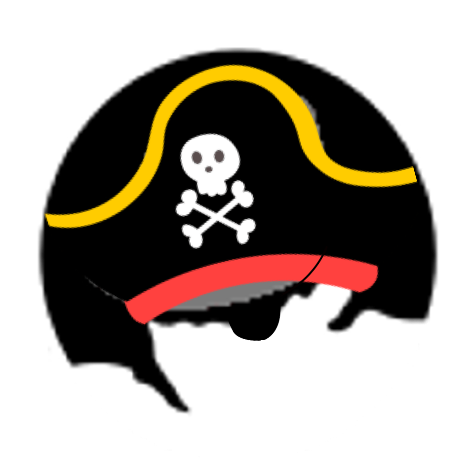

#  Ahoy, able-bodied sailor!

Welcome to the Pentest Pirate Portal (PPP). Here you will find a wealth of resources up-to-date information about our daring pirate schemes.

#  Keep our crew safe!
Best practices for safe piracy:
1. Practice good {GH-PASSWORD-SAFETY}
   - Do not reuse passwords
   - Do not use common/default passwords (e.g. "password", "admin")
   - Do not include personal information in your passwords
   - Use a long, hard-to-guess password with a mix of uppercase, lowercase, numbers, and symbols

2. Do not write down your login credentials anywhere (looking at you, Greybeard)

3. Phishing ≠ fishing. We seamen have all been there before...

<a href="/PentestPiratesExtras/warning.png" class="btn btn-outline-dark">Exploit Agenda</a>
<a href="/index.html" class="btn btn-outline-dark">Log out</a>

	

